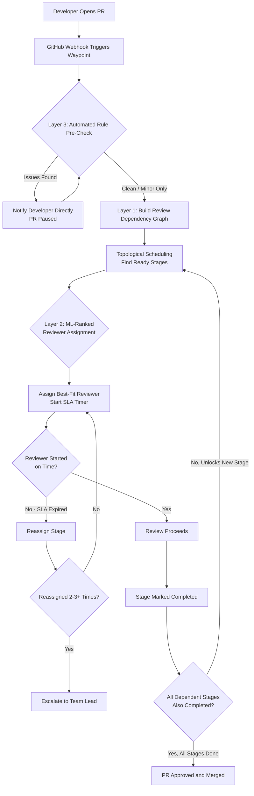
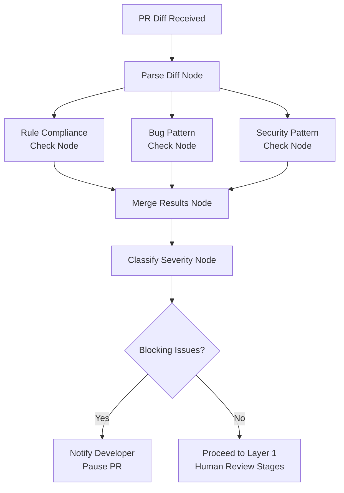
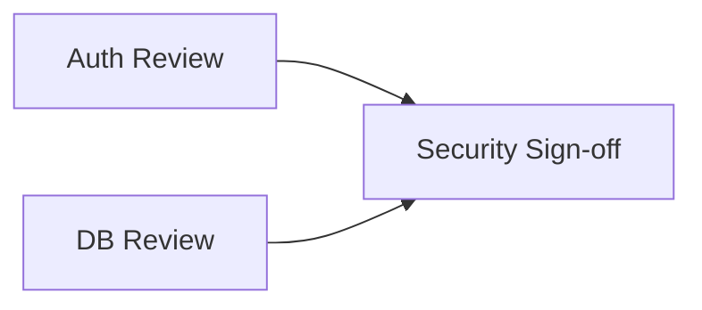
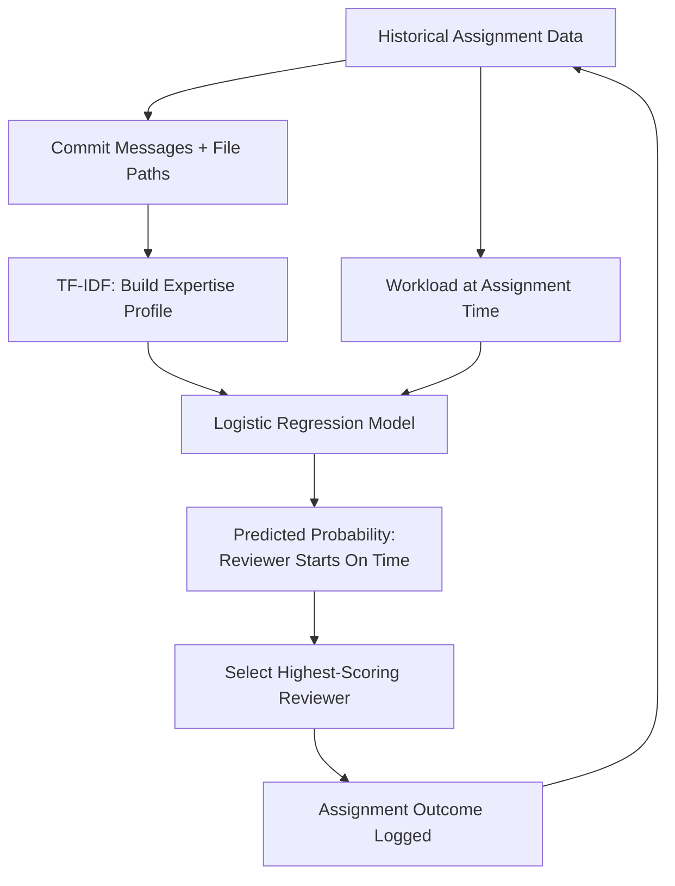
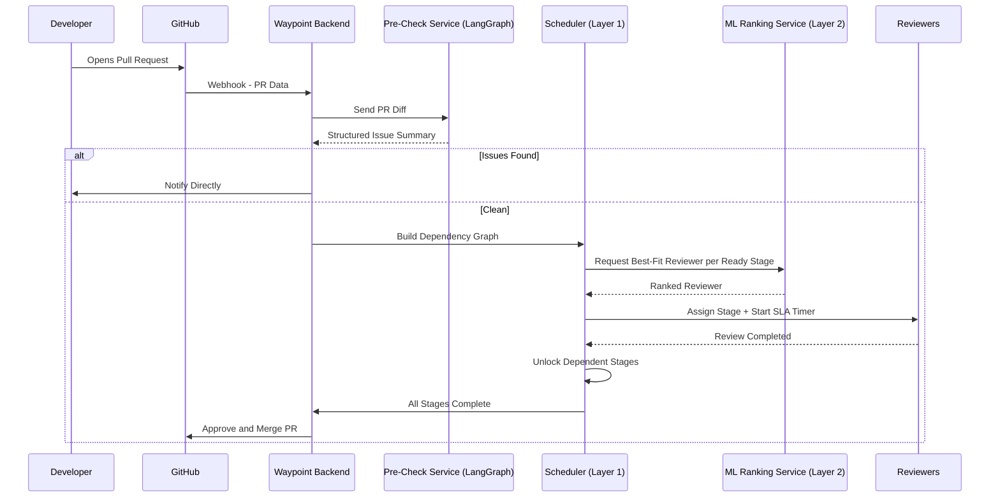

# Waypoint

### Dependency-Aware, SLA-Driven Code Review Orchestration Platform

*A Multi-Layer System for Intelligent Code Review Assignment, Scheduling, and Automated Rule Compliance*

---

## 1. Abstract

Waypoint is a full-stack platform that automates and orchestrates the code review process for software development teams. Unlike traditional round-robin or manual reviewer assignment, Waypoint models each Pull Request (PR) as a **dependency graph of review stages** (e.g., Auth Review, Database Review, Security Sign-off), schedules those stages in the correct order, assigns the best-fit reviewer to each stage using an **expertise-and-workload scoring model enhanced by machine learning**, monitors reviewer responsiveness through **SLA (Service Level Agreement) timers**, and automatically reassigns or escalates stuck reviews. Before any human reviewer is involved, an **automated rule-compliance pre-check** — built using LangChain and LangGraph — scans the code against a defined rules configuration and notifies the developer of issues directly.

The system targets a real, underserved gap: startups, open-source projects, and growing engineering teams that lack the rigid ownership infrastructure large companies (Google, Meta) use to route reviews, and therefore rely on manual or naive automated assignment that ignores both expertise and current workload.

---

## 2. Problem Statement

Software teams face five recurring, unresolved problems in code review management:

1. **No expertise matching** — reviewers are assigned by turn or availability, not by actual knowledge of the code area being changed.
2. **No workload awareness** — the most skilled reviewer keeps getting picked, becomes a bottleneck, while equally capable teammates remain idle.
3. **No structure for large, multi-domain PRs** — a PR touching authentication, database, and infrastructure code genuinely needs multiple specialized reviewers in a defined order, but most tools support only one reviewer per PR.
4. **No accountability for delayed reviews** — if an assigned reviewer goes inactive, the PR simply stalls with no automatic detection or correction.
5. **No pre-filtering before human review** — reviewers spend time catching basic, avoidable issues (missing error handling, style violations, hardcoded secrets) that could be caught automatically before a human is even involved.

---

## 3. Proposed Solution — System Overview

Waypoint addresses all five problems through **three connected layers**, each solving a specific limitation of the layer before it.

| Layer | Responsibility | Core Technique |
|---|---|---|
| **Layer 1 — Core Orchestration Engine** | Splits a PR into review stages, builds a dependency graph, schedules stages in correct order, assigns reviewers, monitors SLAs, reassigns/escalates | Graph theory (DAG + topological scheduling), concurrency-safe database transactions |
| **Layer 2 — Intelligent Ranking** | Learns the right balance between expertise and workload per stage type, instead of using a fixed manual formula | TF-IDF (expertise profiling) + Logistic Regression (learned ranking), with rule-based fallback |
| **Layer 3 — Automated Pre-Check** | Scans PR code against company rules before any human reviewer is involved; notifies the developer directly if issues are found | LangGraph-orchestrated multi-node analysis using LangChain-based LLM calls |

Each layer is independently functional — Layer 1 alone is a complete, working system, meaning the project remains demonstrable even if Layers 2–3 are still evolving.

---

## 4. System Architecture Diagram



---

## 5. Layer 3 Detail — Automated Pre-Check Pipeline (LangGraph)



**How it works:**
- Three independent checks (Rule Compliance, Bug Pattern, Security Pattern) run **in parallel**, each implemented as a focused LangChain call (prompt template + LLM call + structured JSON output parser).
- LangGraph orchestrates these nodes, manages the shared state flowing between them, merges their results, and branches the workflow based on severity.
- This is a **single-pass, non-conversational** pipeline — there is no chatbot or back-and-forth; it runs once per PR and produces one structured summary.

**Shared state structure (conceptual):**
```
ReviewState {
  pr_diff: string
  rule_violations: []
  bug_findings: []
  security_findings: []
  severity: string
  final_summary: string
}
```

---

## 6. Layer 1 Detail — Dependency Graph Example

For a PR that modifies `/auth`, `/db`, and requires a final `/security` sign-off:



- **Auth Review** and **DB Review** run in **parallel** — no dependency between them.
- **Security Sign-off** is **blocked** until both Auth and DB stages are marked `COMPLETED`.
- If a stage's SLA expires, only that stage is reassigned — downstream stages remain correctly blocked until dependencies clear.
- Repeated reassignment of the same stage (2–3+ times) triggers **escalation** instead of infinite reassignment looping.

---

## 7. Layer 2 Detail — ML-Enhanced Ranking

**Problem with a fixed formula:**
```
Score = Expertise − λ × Workload
```
λ is manually chosen and does not adapt per stage type or team context.

**ML-enhanced approach:**



- **TF-IDF** builds a topic-based expertise profile from each reviewer's commit messages and file history, rather than simple file-path counting.
- **Logistic Regression** learns, from real historical outcomes, how much expertise vs. workload actually predicts on-time review completion — separately per stage type.
- **Cold-start handling:** when insufficient historical data exists, the system automatically falls back to the fixed rule-based formula, and this fallback state is visibly indicated in the UI.
- Every assignment outcome is logged and feeds back into future model training — the system improves with usage.

---

## 8. Complexity Justification

| Sub-Problem | Complexity Class | Real-World Parallel |
|---|---|---|
| Dependency graph scheduling with dynamic replanning | Graph theory / topological scheduling | CI/CD pipeline schedulers (GitHub Actions `needs:`, Buildkite, Airflow) |
| Concurrency-safe reviewer assignment | Distributed systems / atomic transactions | Preventing double-booking in high-concurrency systems |
| SLA-triggered reassignment with escalation | Scheduling theory / incident management | PagerDuty-style on-call escalation chains |
| Learned expertise-workload weighting | Applied ML with fallback design | Practical recommendation-ranking systems |
| Structured, parallel LLM-based analysis | LLM orchestration / agentic workflow design | Modern multi-agent LLM pipelines |

---

## 9. Comparison with Industry Practice

| Aspect | Large-Scale Industry Tools (e.g., Google Critique) | Waypoint |
|---|---|---|
| Reviewer routing | Static OWNERS files (ownership-based) | Dynamic expertise + live workload scoring |
| Assignment logic | Rule-based (e.g., "if path X, assign team Y") | Learned, adaptive weighting via ML |
| Pre-check | Static analyzers / linters | LLM-based structured rule and pattern checking |
| Multi-reviewer coordination | Manual, ad hoc | Formal dependency-graph-based orchestration |
| SLA-based auto-reassignment | Not publicly documented at this level | Built-in, with escalation chain |

**Positioning:** Waypoint is designed for teams and organizations that have **not yet formalized rigid code-ownership structures** — startups, open-source projects, student/academic teams, and fast-growing mid-size companies — rather than for organizations at Google/Meta scale, which already solve reviewer routing through static ownership infrastructure.

---

## 10. Technology Stack

| Layer | Technology |
|---|---|
| Frontend | React.js — PR queue, live dependency-graph visualization, SLA countdowns, reviewer workload dashboard, fairness metrics |
| Backend | Node.js + Express.js — webhook handling, graph builder, topological scheduler, SLA engine, REST APIs |
| Database | MongoDB — `pullRequests`, `reviewStages`, `reviewers`, `assignmentHistory`, `codeCheckResults` |
| Real-Time Communication | Socket.io — live stage status updates, SLA warnings, escalation notifications |
| ML Service | Python microservice (scikit-learn: TF-IDF + Logistic Regression) |
| Automated Pre-Check Service | Python microservice (LangGraph + LangChain), single LLM API (Groq) |
| Version Control Integration | GitHub REST API + GitHub Webhooks |

---

## 11. Data Model (Simplified)

```
pullRequests
 - prId, repo, filesChanged, status, createdAt

reviewStages
 - stageId, prId, type (auth / db / security / etc.)
 - dependsOn: [stageId, ...]
 - status: BLOCKED | READY | ASSIGNED | COMPLETED | ESCALATED
 - assignedReviewer, slaDeadline, reassignCount

reviewers
 - reviewerId, expertiseTags, currentOpenReviews

assignmentHistory
 - stageId, reviewerId, expertiseScore, workloadAtAssignment, startedOnTime (label)

codeCheckResults
 - prId, status: PASSED | ISSUES_FOUND
 - issues: [{ rule, line, description }]
 - checkedAt, notifiedAt
```

---

## 12. Unique Features and Demonstration Enhancements

| Feature | Purpose |
|---|---|
| Live DAG visualization | Real-time, color-coded graph of review stages (blocked / ready / in-progress / completed / escalated) |
| Live rule-break demonstration | A prepared rules configuration and intentional violation to show Layer 3 triggering in real time |
| Escalation audit trail | Visible log of reassignments and escalations, proving the delay-handling logic functions correctly |
| ML fallback indicator | UI signal showing when the system is using the rule-based formula due to insufficient historical data |
| What-if SLA simulator | Manually triggerable SLA expiry for demonstration purposes, avoiding real-time waiting during presentation |
| Fairness metric dashboard | Visualization of review load distribution across reviewers over time |

---

## 13. Additional Proposed Features (Future Enhancements)

Beyond the core three layers, the following four features have been identified as high-value extensions. Each reuses infrastructure already present in the system, so they can be layered in without a redesign.

### 13.1 Explainability Panel — "Why This Reviewer?"

**What it does:** Layer 2 already computes a weighted score for each candidate reviewer using Logistic Regression, but currently only surfaces the final ranked choice. This feature exposes the reasoning itself — for example: *"Assigned to Priya — 70% expertise match, 30% low current workload."*

- **Solves:** The ML ranking model currently behaves as a black box; team leads and reviewers cannot see why an assignment was made.
- **How it works:** The ML service already calculates per-factor contributions internally — it returns these percentages alongside the ranked reviewer, and the React frontend renders them as a small breakdown next to each assignment card.
- **Belongs to:** Layer 2 — Intelligent Ranking.
- **Effort:** Low — no new data collection required, only exposing existing model output.

### 13.2 Risk-Weighted SLA

**What it does:** Instead of a flat SLA deadline for every review stage, the deadline is scaled based on how risky the change is. A change to `/auth` or `/security` gets a tighter deadline than a low-risk change like a style fix.

- **Solves:** All review stages currently share the same fixed SLA, regardless of how critical or risky the underlying change is.
- **How it works:** A risk score is derived from existing data — stage type (auth/db/security weighted higher), files changed, and lines changed — and the base SLA is multiplied by this risk factor (e.g., a high-risk auth stage might drop from 24 hours to 8 hours).
- **Belongs to:** Layer 1 — Core Orchestration Engine.
- **Effort:** Low–Medium — reuses existing `reviewStages` and `pullRequests` data; only the SLA calculation logic changes.

### 13.3 Post-Merge Feedback Loop

**What it does:** The ML model currently only learns whether a reviewer *started on time*. This feature tracks what happens *after* merge — if a bug surfaces later and is traced back to a merged PR, that review is retroactively labeled as having missed something, and this feeds back into model training.

- **Solves:** Review speed is currently rewarded independently of review quality; a fast rubber-stamp review and a thorough one are scored identically.
- **How it works:** When a hotfix or bug-fix commit references an earlier merged PR (via commit message or issue link), the system flags the original PR/review as having caused a bug. This is stored as a new label (e.g., `reviewQualityLabel: GOOD | MISSED_BUG`) in `assignmentHistory`, and the Logistic Regression model is periodically retrained using both labels.
- **Belongs to:** Layer 2 — Intelligent Ranking.
- **Effort:** Medium — requires a lightweight process to link hotfix commits back to their originating PR, plus one new field in the data model.

### 13.4 Auto-Generated PR Summary

**What it does:** Before a human reviewer opens the code, an LLM generates a short 2–3 line summary of what the PR changes and why — e.g., *"This PR adds Google OAuth login, modifies the authentication middleware, and updates the user database schema to store provider tokens."*

- **Solves:** Reviewers currently have to read the full diff cold to understand a PR's purpose, which slows down ramp-up — especially on large, multi-domain PRs.
- **How it works:** The PR diff is already sent through the Layer 3 Pre-Check pipeline (LangGraph + LangChain) for rule, bug, and security checks. One additional lightweight LangChain node is added to that same pipeline to generate the summary, which is stored alongside `codeCheckResults` and shown at the top of the PR view.
- **Belongs to:** Layer 3 — Automated Pre-Check.
- **Effort:** Low — adds one more parallel node to the existing LangGraph pipeline; no new service required.

### Summary Table

| Feature | Solves | Layer | Effort |
|---|---|---|---|
| Explainability Panel | ML feels like a black box | Layer 2 (Ranking) | Low |
| Risk-Weighted SLA | All stages treated equally urgent | Layer 1 (Orchestration) | Low–Medium |
| Post-Merge Feedback Loop | Speed rewarded over review quality | Layer 2 (Ranking) | Medium |
| Auto-Generated PR Summary | Reviewer ramp-up time on large PRs | Layer 3 (Pre-Check) | Low |

---

## 14. Full End-to-End Flow Summary



---

## 15. Conclusion

Waypoint combines graph-based scheduling, machine learning, and LLM-based orchestration into a single, coherent system that solves a real and currently unaddressed gap in code review management for teams without mature ownership infrastructure. Each layer is independently justified, independently functional, and independently demonstrable, making the project both technically substantial and practically deliverable within an academic timeline.

---

*Prepared as part of a final-year academic project submission.*
