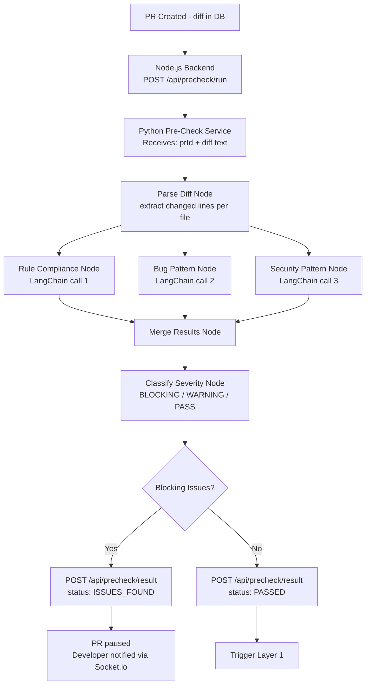
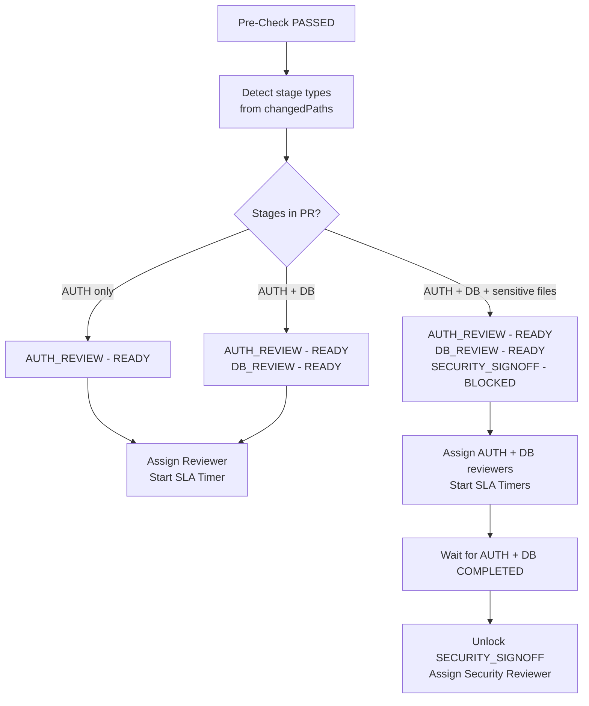
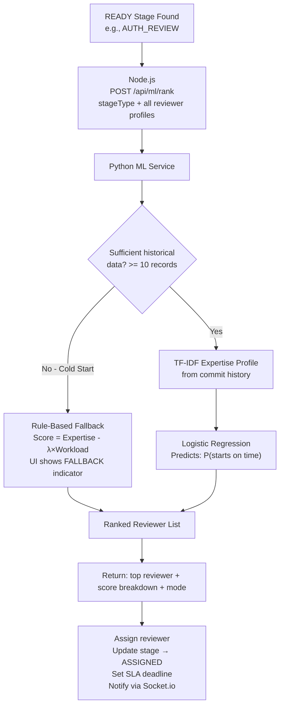
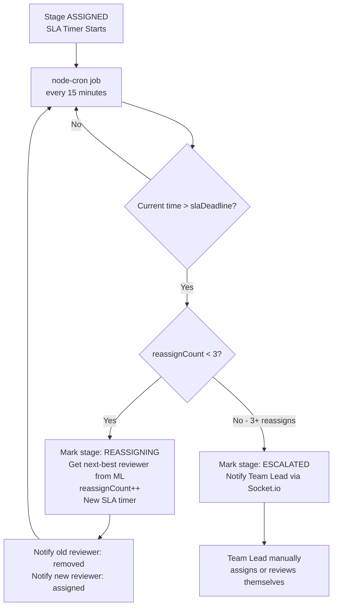
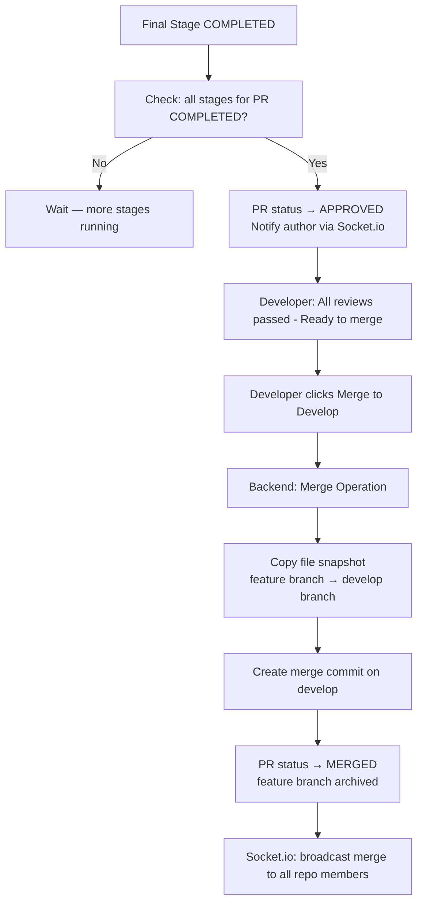
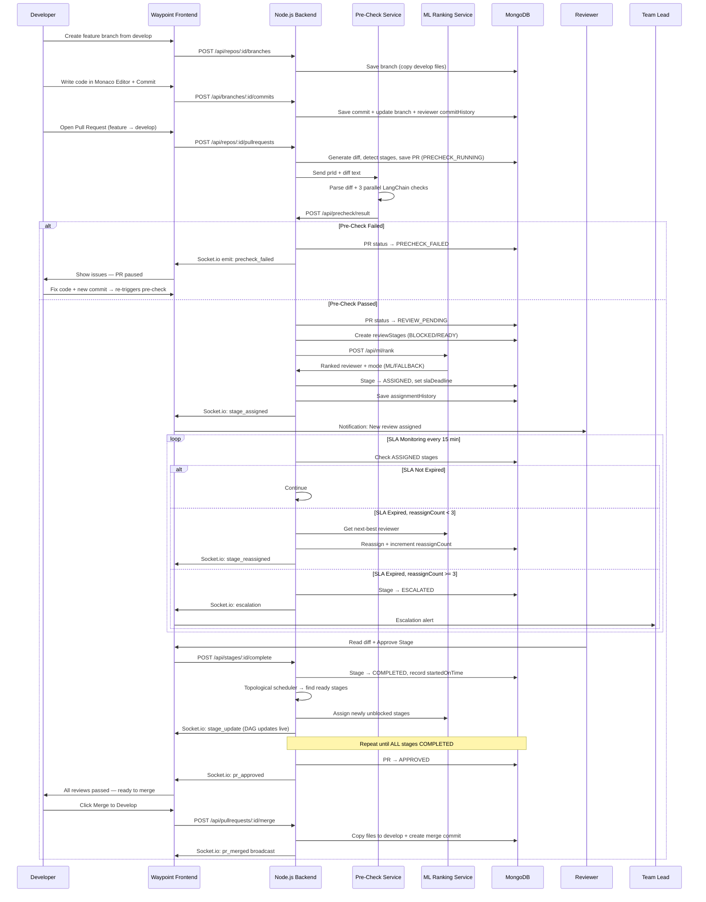

# Waypoint — Complete End-to-End Workflow

### From Code Push to Merge: Every Step, Every Decision, Every System Component

---

## Table of Contents

1. [System Overview](#1-system-overview)
2. [User Roles](#2-user-roles)
3. [Platform Setup Flow (One-Time)](#3-platform-setup-flow-one-time)
4. [Developer Daily Flow — Push Code & Raise PR](#4-developer-daily-flow--push-code--raise-pr)
5. [Layer 3 — Automated Pre-Check (LangGraph)](#5-layer-3--automated-pre-check-langgraph)
6. [Layer 1 — Dependency Graph & Stage Scheduling](#6-layer-1--dependency-graph--stage-scheduling)
7. [Layer 2 — ML Reviewer Assignment](#7-layer-2--ml-reviewer-assignment)
8. [SLA Monitoring & Escalation](#8-sla-monitoring--escalation)
9. [Review Completion & Merge Flow](#9-review-completion--merge-flow)
10. [Full Master Sequence Diagram](#10-full-master-sequence-diagram)
11. [Database Operations at Each Step](#11-database-operations-at-each-step)
12. [API Endpoints Reference](#12-api-endpoints-reference)
13. [Technology Stack Mapping](#13-technology-stack-mapping)
14. [What the UI Shows at Each Stage](#14-what-the-ui-shows-at-each-stage)

---

## 1. System Overview

Waypoint is a **self-contained code review orchestration platform**. It does NOT use GitHub — it has its own repository system, branch model, commit storage, diff generation, and merge logic — all stored in MongoDB.

```
┌─────────────────────────────────────────────────────────────┐
│                        WAYPOINT PLATFORM                     │
│                                                             │
│  ┌──────────┐    ┌──────────┐    ┌──────────────────────┐  │
│  │   React  │    │ Node.js  │    │   Python Services    │  │
│  │ Frontend │◄──►│ Express  │◄──►│  ┌────────────────┐  │  │
│  │          │    │ Backend  │    │  │ LangGraph +    │  │  │
│  │ Monaco   │    │          │    │  │ LangChain      │  │  │
│  │ Editor   │    │ Socket.io│    │  │ (Pre-Check)    │  │  │
│  │ DAG View │    │          │    │  ├────────────────┤  │  │
│  │ SLA Timer│    │ MongoDB  │    │  │ scikit-learn   │  │  │
│  └──────────┘    └──────────┘    │  │ TF-IDF + LR    │  │  │
│                                  │  │ (ML Ranking)   │  │  │
│                                  │  └────────────────┘  │  │
│                                  └──────────────────────┘  │
└─────────────────────────────────────────────────────────────┘
```

### Core Concept — Simulated Git in MongoDB

Waypoint simulates Git branch logic using database documents. There is **no real git CLI**. Instead:

| Git Concept | Waypoint Equivalent |
|---|---|
| Repository | `repositories` MongoDB collection |
| Branch | `branches` collection document |
| Commit | `commits` collection — stores full file snapshots |
| Push | HTTP POST to Waypoint API — saves commit to branch |
| Pull Request | `pullRequests` collection — links two branch IDs |
| Diff | Generated server-side using `diff` npm package |
| Merge | Server copies file snapshots from source to target branch |

---

## 2. User Roles

| Role | Who They Are | Permissions |
|---|---|---|
| **Owner** | Project creator | Creates repo, invites members, appoints team leads |
| **Team Lead** | Senior developer | Receives escalations, approves final merge to main |
| **Developer** | Contributor | Pushes code, raises PRs |
| **Reviewer** | Peer reviewer | Reviews assigned stages, approves/requests changes |

> A single person can hold multiple roles (e.g., a developer can also be a reviewer).

---

## 3. Platform Setup Flow (One-Time)

### 3.1 User Registration & Login

```
1. User visits waypoint.app/register
2. Enters: Name, Email, Password, Role
3. JWT token issued on login
4. All subsequent API calls use JWT
```

**What happens in the DB:**
```json
{
  "_id": "rev_001",
  "name": "Priya Sharma",
  "email": "priya@company.com",
  "role": "reviewer",
  "expertiseTags": [],
  "currentOpenReviews": 0,
  "commitHistory": [],
  "createdAt": "2026-01-01"
}
```

---

### 3.2 Repository Creation

**Owner action in UI:**
```
Dashboard → "New Repository"
  → Enter: Repo Name, Description
  → Select: Members to invite
  → Select: Team Lead for this repo
  → Click "Create Repository"
```

**Auto-created on repo creation:**
```json
{ "_id": "branch_main",    "name": "main",    "repoId": "repo_001", "files": [] }
{ "_id": "branch_develop", "name": "develop", "repoId": "repo_001", "files": [] }
```

---

### 3.3 Branch Strategy Overview

```
main ──────────────────────────────────────────►  (production-ready, protected)
       ▲                                    ▲
       │ merge (after testing)              │
develop ──────────────────────────────────►    (integration branch)
       ▲              ▲
       │ merge        │ merge
feature/login      feature/payment
  (developer A)    (developer B)
```

**Branch Rules (enforced by Waypoint backend):**
- Developers can only push to `feature/*` branches
- PRs can only target `develop` (not `main` directly)
- Only Team Lead can merge `develop → main`
- Direct push to `develop` or `main` is blocked by API

---

## 4. Developer Daily Flow — Push Code & Raise PR

### Step 1 — Create a Feature Branch

**Developer action in UI:**
```
Inside Repo → "Branches" tab
  → Click "New Branch"
  → Branch name: feature/add-login
  → Source branch: develop
  → Click "Create"
```

**Backend operation:**
```javascript
POST /api/repos/:repoId/branches

// Server:
// 1. Find latest commit on "develop"
// 2. Copy its file snapshot to new branch
// 3. Save new branch document

const sourceBranch = await Branch.findOne({ name: 'develop', repoId });
const newBranch = new Branch({
  name: 'feature/add-login',
  repoId,
  files: sourceBranch.files,   // inherit current file state
  createdBy: userId,
  sourceBranch: 'develop'
});
await newBranch.save();
```

---

### Step 2 — Write Code in the Browser Editor

**Developer action in UI:**
```
Feature Branch view → "Files" tab
  → Click "New File" or click existing file
  → Monaco Editor opens (VS Code-like editor in browser)
  → Write/edit code
  → Click "Stage Changes"
```

> **Monaco Editor** is the same editor powering VS Code. Embedded via `@monaco-editor/react` npm package.

---

### Step 3 — Commit (Push Code to Branch)

**Developer action in UI:**
```
After staging changes:
  → Write commit message: "Add login endpoint with JWT"
  → Click "Commit & Push"
```

**Backend operation:**
```javascript
POST /api/repos/:repoId/branches/:branchId/commits

const commit = new Commit({
  branchId,
  repoId,
  authorId: userId,
  message: 'Add login endpoint with JWT',
  files: updatedFiles,          // full snapshot of ALL branch files
  changedFiles: ['src/auth/login.js'],
  createdAt: new Date()
});
await commit.save();

// Update branch
await Branch.findByIdAndUpdate(branchId, {
  files: updatedFiles,
  latestCommitId: commit._id
});

// Update reviewer expertise history for ML
await Reviewer.findByIdAndUpdate(userId, {
  $push: { commitHistory: {
    files: ['src/auth/login.js'],
    message: 'Add login endpoint with JWT'
  }}
});
```

**DB result:**
```json
{
  "_id": "commit_001",
  "branchId": "branch_feature_login",
  "repoId": "repo_001",
  "authorId": "user_002",
  "message": "Add login endpoint with JWT",
  "files": [
    { "path": "src/auth/login.js", "content": "const express = ..." }
  ],
  "changedFiles": ["src/auth/login.js"],
  "createdAt": "2026-01-15T10:00:00Z"
}
```

---

### Step 4 — Open a Pull Request

**Developer action in UI:**
```
Feature Branch view → "Open Pull Request"
  → From: feature/add-login
  → To:   develop
  → Title: "Add login endpoint with JWT auth"
  → Description: "This PR adds login API, JWT middleware..."
  → Click "Create Pull Request"
```

**Backend operation — Diff Generation + Stage Detection:**
```javascript
POST /api/repos/:repoId/pullrequests

// 1. Fetch file snapshots of both branches
const fromFiles = await Branch.findById(fromBranchId).files;
const toFiles   = await Branch.findById(toBranchId).files;

// 2. Generate unified diff using 'diff' npm package
const diffResult = generateDiff(fromFiles, toFiles);

// 3. Detect stage types from changed file paths
const stageTypes = detectStageTypes(diffResult.changedPaths);
// src/auth/* → AUTH_REVIEW
// src/db/*   → DB_REVIEW
// AUTH + DB together → also adds SECURITY_SIGNOFF dependency

const pr = new PullRequest({
  repoId,
  fromBranch: fromBranchId,
  toBranch: toBranchId,
  title, description,
  authorId: userId,
  diff: diffResult.unifiedDiff,
  changedPaths: diffResult.changedPaths,
  stageTypes,
  status: 'PRECHECK_RUNNING'
});
await pr.save();

// Fire Layer 3 immediately
triggerPreCheck(pr._id, diffResult.unifiedDiff);
```

**Stage Type Detection Rules:**
```javascript
const STAGE_RULES = [
  { pattern: /src\/auth\//,        stage: 'AUTH_REVIEW'      },
  { pattern: /src\/db\//,          stage: 'DB_REVIEW'        },
  { pattern: /src\/models\//,      stage: 'DB_REVIEW'        },
  { pattern: /src\/middleware\//,  stage: 'AUTH_REVIEW'      },
  { pattern: /infrastructure\//,   stage: 'INFRA_REVIEW'     },
  { pattern: /\.env/,              stage: 'SECURITY_SIGNOFF' },
  { pattern: /src\/payments\//,    stage: 'SECURITY_SIGNOFF' },
];
// Default if no match: GENERAL_REVIEW
// AUTH_REVIEW + DB_REVIEW together → system also creates SECURITY_SIGNOFF stage
```

---

## 5. Layer 3 — Automated Pre-Check (LangGraph)



### 5.1 LangGraph State Object

```python
class ReviewState(TypedDict):
    pr_id: str
    diff_text: str
    parsed_chunks: list
    rule_violations: list
    bug_findings: list
    security_findings: list
    severity: str             # BLOCKING | WARNING | PASS
    final_summary: str
```

### 5.2 Three Parallel LangChain Nodes

```python
# Node 1: Rule Compliance
rule_prompt = ChatPromptTemplate.from_template("""
Review this diff for rule violations:
- No hardcoded secrets or API keys
- All functions must have error handling
- No console.log in production code
- Functions must not exceed 50 lines
Diff: {diff_text}
Return JSON: {{ "violations": [{{ "rule": "...", "line": N, "description": "..." }}] }}
""")

# Node 2: Bug Pattern
bug_prompt = ChatPromptTemplate.from_template("""
Analyze this diff for bug patterns:
- Null/undefined dereference risks
- Missing await on async calls
- Unclosed resources
Diff: {diff_text}
Return JSON: {{ "bugs": [{{ "pattern": "...", "line": N, "risk": "HIGH|MEDIUM|LOW" }}] }}
""")

# Node 3: Security Pattern
security_prompt = ChatPromptTemplate.from_template("""
Scan this diff for security vulnerabilities:
- NoSQL injection risks
- Missing input validation
- Insecure JWT handling
Diff: {diff_text}
Return JSON: {{ "issues": [{{ "type": "...", "line": N, "severity": "CRITICAL|HIGH|MEDIUM" }}] }}
""")
```

### 5.3 What Developer Sees When Pre-Check Fails

```
┌──────────────────────────────────────────────────────────────────┐
│  ⚠  Pre-Check Failed — 3 Issues Found                           │
│  PR: "Add login endpoint with JWT auth"                          │
├──────────────────────────────────────────────────────────────────┤
│  🔴 BLOCKING                                                     │
│  [Security] Line 14 — Hardcoded JWT secret detected              │
│  > const SECRET = "mysecret123"                                  │
│  Fix: Move to environment variable                               │
│                                                                  │
│  🟡 WARNING                                                      │
│  [Bug] Line 27 — Missing await on async DB call                  │
│  [Rule] Line 42 — Function exceeds 50 line limit (53 lines)      │
│                                                                  │
│  Status: PR Paused — Fix blocking issues and re-push             │
│  [Go to Editor]                                                  │
└──────────────────────────────────────────────────────────────────┘
```

> Developer fixes code → makes another commit → PR **auto re-triggers pre-check**.

### 5.4 Pre-Check Result in DB

```json
{
  "_id": "check_001",
  "prId": "pr_001",
  "status": "ISSUES_FOUND",    // RUNNING | PASSED | ISSUES_FOUND
  "issues": [
    { "type": "SECURITY", "rule": "hardcoded-secret", "line": 14,
      "description": "Hardcoded JWT secret", "severity": "BLOCKING" }
  ],
  "summary": "1 blocking issue, 2 warnings",
  "checkedAt": "2026-01-15T10:05:00Z"
}
```

---

## 6. Layer 1 — Dependency Graph & Stage Scheduling

*Triggered only after Pre-Check PASSES.*



### 6.1 Review Stages Created in DB

For a PR touching `/src/auth/` and `/src/db/`:

```json
{ "_id": "stage_001", "prId": "pr_001", "type": "AUTH_REVIEW",
  "dependsOn": [], "status": "READY", "assignedReviewer": null,
  "slaDeadline": null, "reassignCount": 0 }

{ "_id": "stage_002", "prId": "pr_001", "type": "DB_REVIEW",
  "dependsOn": [], "status": "READY", "assignedReviewer": null,
  "slaDeadline": null, "reassignCount": 0 }

{ "_id": "stage_003", "prId": "pr_001", "type": "SECURITY_SIGNOFF",
  "dependsOn": ["stage_001", "stage_002"],
  "status": "BLOCKED", "assignedReviewer": null,
  "slaDeadline": null, "reassignCount": 0 }
```

### 6.2 Topological Scheduling Logic

```javascript
function getReadyStages(allStages) {
  return allStages.filter(stage => {
    if (stage.status !== 'BLOCKED') return false;
    return stage.dependsOn.every(depId => {
      const dep = allStages.find(s => s._id.toString() === depId);
      return dep.status === 'COMPLETED';
    });
  });
}

// After each stage completes:
// 1. Mark stage COMPLETED
// 2. Call getReadyStages() → find newly unblocked stages
// 3. For each newly ready stage → call Layer 2 for assignment
```

### 6.3 Live DAG Visualization in UI

```
[AUTH_REVIEW]  ───┐
  🟡 IN PROGRESS  │
                  ├──► [SECURITY_SIGNOFF]
[DB_REVIEW]    ───┘      ⬜ BLOCKED
  🟢 COMPLETED
```

Color coding: ⬜ BLOCKED | 🔵 READY | 🟡 IN PROGRESS | 🟢 COMPLETED | 🔴 ESCALATED

---

## 7. Layer 2 — ML Reviewer Assignment

*Called for each READY stage.*



### 7.1 TF-IDF Expertise Profiling

```python
from sklearn.feature_extraction.text import TfidfVectorizer
from sklearn.metrics.pairwise import cosine_similarity

def build_expertise_profile(reviewer):
    corpus = []
    for commit in reviewer['commitHistory']:
        text = commit['message'] + ' ' + ' '.join(commit['files'])
        corpus.append(text)
    vectorizer = TfidfVectorizer()
    profile = vectorizer.fit_transform(corpus)
    return profile, vectorizer

def compute_expertise_score(reviewer_profile, stage_type_keywords):
    # AUTH_REVIEW keywords: ['auth', 'jwt', 'login', 'middleware', 'token']
    stage_vector = vectorizer.transform([' '.join(stage_type_keywords)])
    return cosine_similarity(reviewer_profile, stage_vector)[0][0]
```

### 7.2 Logistic Regression Ranking

```python
def rank_reviewers(stage_type, candidates, assignment_history):
    if len(assignment_history) < 10:
        LAMBDA = 0.3
        scores = [(r, r['expertise'] - LAMBDA * r['workload']) for r in candidates]
        return sorted(scores, key=lambda x: x[1], reverse=True), 'FALLBACK'

    model = LogisticRegression()
    model.fit(X_train, y_train)   # features: expertise, workload, stage_type
    probabilities = model.predict_proba(X_candidates)[:, 1]
    ranked = sorted(zip(candidates, probabilities), key=lambda x: x[1], reverse=True)
    return ranked, 'ML'
```

### 7.3 Explainability Panel in UI

```
┌────────────────────────────────────────────────────────┐
│  AUTH_REVIEW → Assigned to: Priya Sharma               │
│  ────────────────────────────────────────────────────  │
│  Why Priya?                                            │
│  ████████████████████░░░░   87% Expertise Match        │
│  ████░░░░░░░░░░░░░░░░░░░░   Low Workload (2 reviews)   │
│  Predicted on-time probability: 91%     [ML Model]     │
│  SLA: 24 hours  |  Expires: Jan 16, 10:10 AM           │
└────────────────────────────────────────────────────────┘
```

### 7.4 Assignment Stored in DB

```json
// reviewStages updated
{
  "_id": "stage_001",
  "status": "ASSIGNED",
  "assignedReviewer": "rev_003",
  "assignedAt": "2026-01-15T10:10:00Z",
  "slaDeadline": "2026-01-16T10:10:00Z",
  "reassignCount": 0,
  "assignmentMode": "ML"
}

// assignmentHistory new record
{
  "_id": "hist_001",
  "stageId": "stage_001",
  "reviewerId": "rev_003",
  "expertiseScore": 0.87,
  "workloadAtAssignment": 2,
  "assignmentMode": "ML",
  "startedOnTime": null    // filled after reviewer responds
}
```

---

## 8. SLA Monitoring & Escalation



### 8.1 Risk-Weighted SLA Calculation

```javascript
function calculateSLA(stage, pr) {
  const BASE_SLA_HOURS = 24;
  const RISK_WEIGHTS = {
    'AUTH_REVIEW':      1.5,
    'SECURITY_SIGNOFF': 2.0,    // tightest deadline
    'DB_REVIEW':        1.2,
    'INFRA_REVIEW':     1.3,
    'GENERAL_REVIEW':   1.0
  };
  const linesChanged = pr.diff.split('\n').length;
  const sizeFactor = linesChanged > 500 ? 1.5 : 1.0;  // large PRs get more time
  const riskFactor = RISK_WEIGHTS[stage.type];
  const adjustedHours = BASE_SLA_HOURS / riskFactor * sizeFactor;
  return new Date(Date.now() + adjustedHours * 3600 * 1000);
}
// Examples:
// SECURITY_SIGNOFF, small PR → 24/2.0 = 12 hours
// GENERAL_REVIEW, large PR   → 24/1.0 * 1.5 = 36 hours
```

### 8.2 SLA Display in UI

```
┌─────────────────────────────────────────────────────┐
│  DB_REVIEW — Assigned to: Rahul Mehta               │
│  ⏱  SLA Remaining:  14:32:07                        │
│  ████████████████░░░░░░░░░░  60% time remaining     │
│  [Trigger SLA Expiry Now]  ← demo presentation btn  │
└─────────────────────────────────────────────────────┘
```

---

## 9. Review Completion & Merge Flow

### 9.1 Reviewer Takes Action

**Reviewer action in UI:**
```
My Reviews → Stage: AUTH_REVIEW
  → Opens PR diff view (Monaco Diff Viewer)
  → Reads highlighted changed lines
  → Adds inline comments (optional)
  → Clicks "Approve Stage" OR "Request Changes"
```

**Backend on "Approve Stage":**
```javascript
POST /api/stages/:stageId/complete

// 1. Mark stage COMPLETED
await Stage.findByIdAndUpdate(stageId, {
  status: 'COMPLETED',
  completedAt: new Date()
});

// 2. Record startedOnTime for ML training data
const startedOnTime = new Date() < stage.slaDeadline;
await AssignmentHistory.findOneAndUpdate({ stageId }, { startedOnTime });

// 3. Reduce reviewer workload count
await Reviewer.findByIdAndUpdate(stage.assignedReviewer, {
  $inc: { currentOpenReviews: -1 }
});

// 4. Topological scheduler → find newly unblocked stages
const allStages = await Stage.find({ prId: stage.prId });
const newlyReady = getReadyStages(allStages);

// 5. For each newly ready stage → trigger Layer 2 assignment
for (const readyStage of newlyReady) {
  await assignReviewer(readyStage);
}

// 6. Real-time update to all connected clients
io.to(pr.repoId).emit('stage_update', { stageId, status: 'COMPLETED' });
```

---

### 9.2 All Stages Complete → Merge to Develop



**Merge Operation (MongoDB Snapshot Copy):**
```javascript
async function mergePR(prId) {
  const pr = await PullRequest.findById(prId);
  const sourceBranch = await Branch.findById(pr.fromBranch);
  const targetBranch = await Branch.findById(pr.toBranch);  // develop

  // Source files overwrite matching target files (clean merge, no conflict resolution)
  const mergedFiles = mergeFileSets(targetBranch.files, sourceBranch.files);

  const mergeCommit = new Commit({
    branchId: targetBranch._id,
    repoId: pr.repoId,
    message: `Merge PR: ${pr.title}`,
    files: mergedFiles,
    isMergeCommit: true,
    mergedFromPR: prId
  });
  await mergeCommit.save();

  await Branch.findByIdAndUpdate(targetBranch._id, {
    files: mergedFiles,
    latestCommitId: mergeCommit._id
  });

  await PullRequest.findByIdAndUpdate(prId, {
    status: 'MERGED',
    mergedAt: new Date()
  });
}
```

---

### 9.3 Develop → Main (Production Merge)

*Only Team Lead can do this.*

```
Team Lead Dashboard → Develop branch → "Merge to Main"
  → System checks: no open PRs pending
  → Team Lead confirms
  → Same merge operation: develop files → main branch
  → "Production updated" notification broadcast to all members
```

---

## 10. Full Master Sequence Diagram



---

## 11. Database Operations at Each Step

| Action | Collection | Operation |
|---|---|---|
| Register user | `reviewers` | INSERT |
| Create repo | `repositories` | INSERT |
| Auto-create branches | `branches` | INSERT ×2 |
| Create feature branch | `branches` | INSERT (copy parent files) |
| Commit code | `commits` | INSERT; `branches` UPDATE |
| Open PR | `pullRequests` | INSERT; `codeCheckResults` INSERT (RUNNING) |
| Pre-check result | `codeCheckResults` UPDATE; `pullRequests` UPDATE | UPDATE ×2 |
| Build stages | `reviewStages` | INSERT ×N |
| Assign reviewer | `reviewStages` UPDATE; `assignmentHistory` INSERT | UPDATE + INSERT |
| SLA expiry reassign | `reviewStages` UPDATE (new reviewer, reassignCount++) | UPDATE |
| Escalation | `reviewStages` UPDATE (ESCALATED) | UPDATE |
| Stage complete | `reviewStages` UPDATE; `assignmentHistory` UPDATE (startedOnTime) | UPDATE ×2 |
| PR merge | `branches` UPDATE (develop files); `commits` INSERT; `pullRequests` UPDATE | UPDATE + INSERT |

---

## 12. API Endpoints Reference

### Auth
```
POST   /api/auth/register
POST   /api/auth/login
GET    /api/auth/me
```

### Repositories & Branches
```
POST   /api/repos                                       Create repo
GET    /api/repos/:repoId                               Get repo details
POST   /api/repos/:repoId/branches                      Create branch
GET    /api/repos/:repoId/branches                      List branches
GET    /api/repos/:repoId/branches/:branchId            Get branch + files
```

### Commits
```
POST   /api/repos/:repoId/branches/:branchId/commits    Push code
GET    /api/repos/:repoId/branches/:branchId/commits    Commit history
```

### Pull Requests
```
POST   /api/repos/:repoId/pullrequests                  Open PR
GET    /api/repos/:repoId/pullrequests                  List PRs
GET    /api/pullrequests/:prId                           PR details + diff
POST   /api/pullrequests/:prId/merge                    Merge PR
```

### Stages & Reviews
```
GET    /api/pullrequests/:prId/stages                   Get all stages + DAG
POST   /api/stages/:stageId/complete                    Approve stage
POST   /api/stages/:stageId/request-changes             Request changes
POST   /api/stages/:stageId/escalate                    Manual escalation
```

### Internal Services
```
POST   /api/precheck/run                                Trigger pre-check
POST   /api/precheck/result                             Python service callback
POST   /api/ml/rank                                     Request reviewer ranking
```

### Dashboard & Analytics
```
GET    /api/dashboard/reviewer/:id                      Reviewer workload + history
GET    /api/dashboard/fairness                          Fairness metrics across team
GET    /api/dashboard/pr-timeline/:prId                 Full PR audit trail
```

---

## 13. Technology Stack Mapping

| Component | Technology | Purpose |
|---|---|---|
| Frontend | React.js | SPA for all UI |
| Code Editor | `@monaco-editor/react` | Write/edit code in-browser |
| Diff Viewer | `react-diff-viewer` | Show PR diff with syntax highlight |
| DAG Visualization | `react-flow` | Live dependency graph rendering |
| Real-Time (Client) | Socket.io client | SLA countdowns, stage updates |
| Backend | Node.js + Express.js | REST API + business logic |
| Real-Time (Server) | Socket.io server | Push events to frontend |
| Database | MongoDB + Mongoose | All data storage |
| Diff Generation | `diff` npm package | Generate unified diffs from snapshots |
| Scheduled Jobs | `node-cron` | SLA monitoring every 15 minutes |
| Pre-Check Service | Python + FastAPI | LangGraph pipeline exposed via REST |
| LLM Orchestration | LangGraph + LangChain | Multi-node parallel analysis |
| LLM Provider | Groq API | Fast inference, free tier |
| ML Service | Python + FastAPI | TF-IDF + Logistic Regression |
| Auth | JWT + bcrypt | Stateless authentication |

---

## 14. What the UI Shows at Each Stage

### Developer View — PR Timeline

```
PR: "Add login endpoint with JWT auth"   feature/add-login → develop
──────────────────────────────────────────────────────────────────

● Pre-Check Running...                10:05 AM
  ↓
✅ Pre-Check Passed                   10:05 AM
  ↓
🔵 AUTH_REVIEW  → Priya Sharma  (SLA: 23:41 remaining)
🔵 DB_REVIEW    → Rahul Mehta   (SLA: 23:41 remaining)
⬜ SECURITY_SIGNOFF → Blocked (waiting for AUTH + DB)
  ↓
✅ DB_REVIEW Completed                10:55 AM  [Rahul Mehta]
🟡 AUTH_REVIEW Still Running          (SLA: 22:41)
⬜ SECURITY_SIGNOFF → Still Blocked
  ↓
✅ AUTH_REVIEW Completed              11:30 AM  [Priya Sharma]
🔵 SECURITY_SIGNOFF → Vikram Nair    (SLA: 24:00 remaining)
  ↓
✅ SECURITY_SIGNOFF Completed         12:15 PM  [Vikram Nair]
  ↓
🎉 All Reviews Passed! → [Merge to Develop]
```

### Reviewer View — My Reviews

```
┌──────────────────────────────────────────────────────────┐
│  AUTH_REVIEW                                             │
│  PR: "Add login endpoint with JWT auth"                  │
│  Repo: payment-service                                   │
│  ⏱ SLA: 22:41:07 remaining                              │
│  Why me: 87% expertise match (JWT, auth, middleware)     │
│  [View Diff & Review]  [Approve Stage]  [Request Changes]│
└──────────────────────────────────────────────────────────┘
```

### Team Lead View — Escalation Alert

```
🚨 ESCALATION ALERT
  Stage: AUTH_REVIEW | PR: "Add login endpoint"
  Reassigned 3 times — no reviewer responded
  Last assigned: Priya Sharma
  [Assign to Me]  [Manually Assign Reviewer]
```

### Fairness Dashboard

```
Review Load Distribution — Last 30 Days
─────────────────────────────────────────
Priya Sharma  ████████████████████  20 reviews
Rahul Mehta   ██████████████        14 reviews
Vikram Nair   ████████               8 reviews
Ananya Iyer   ██████                 6 reviews

⚠ Load imbalance detected — Vikram and Ananya are underutilized
```

---

## Known Scope Limitations

| Limitation | Reason | Mitigation |
|---|---|---|
| No merge conflict resolution | Real git conflict handling is out of scope | Assume clean merges; state explicitly in documentation |
| Binary file support excluded | Only text/code files needed | Sufficient for code review use case |
| Branch always from latest commit | No arbitrary commit branching | Sufficient for the PR workflow |
| LLM accuracy varies | LLM may miss some issues | Framed as pre-screening, not replacement for human review |
| ML cold start | No historical data on fresh install | Synthetic seed data + fallback indicator in UI |

---

*This document describes the complete, implementable workflow for Waypoint.*
*Every section maps to a concrete, buildable component.*
